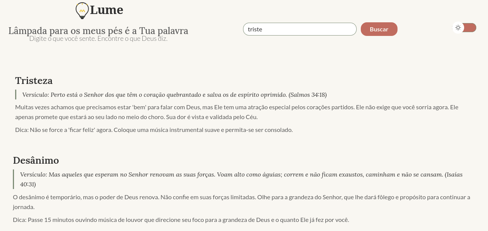
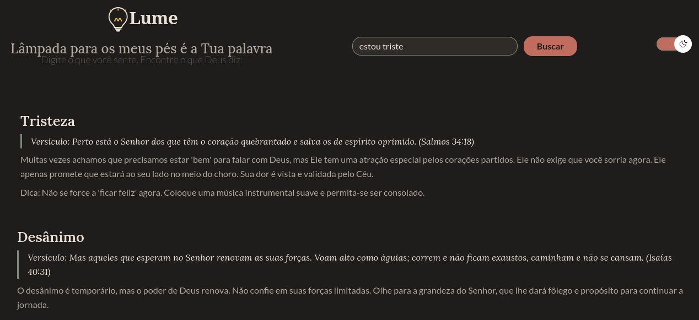

#  Lume💡

> "Lâmpada para os meus pés é a Tua palavra e luz para o meu caminho." (Salmos 119:105)

  

## 🔗 Acesse o Projeto

Clique no link abaixo para testar a aplicação funcionando:

### 👉 [**CLIQUE AQUI PARA ACESSAR O LUME**](https://lidiavidal.github.io/lume-buscaBiblica/))

---

## 📖 Sobre o Projeto

**Você já sentiu algo intenso e não soube onde buscar conforto?**

O **Lume** é uma aplicação web focada em **saúde espiritual e acolhimento**. Muitas vezes, as pessoas buscam uma palavra de encorajamento na Bíblia, mas não sabem exatamente onde procurar quando estão sentindo ansiedade, tristeza ou desânimo. O Lume resolve isso simplificando a busca: ele conecta **sentimentos humanos** a **respostas divinas**.

Diferente de um buscador comum, o Lume foi desenhado para ser uma experiência completa. Ao digitar como se sente (ex: "estou ansiosa" ou "triste"), o usuário recebe um card tridimensional de ajuda:
1.  **O Versículo:** A base bíblica para o sentimento.
2.  **A Reflexão:** Uma explicação empática sobre aquele texto.
3.  **A Dica Prática:** Uma ação real (como ouvir uma música, fazer uma oração específica ou respirar fundo) para melhorar o dia da pessoa imediatamente.

O objetivo é ser um "porto seguro" digital, com uma interface limpa, sem distrações e visualmente confortável.

## 🚀 Origem e Desenvolvimento (Imersão Dev)

Este projeto foi idealizado e desenvolvido durante a **Imersão Dev com Google Gemini 10ª Edição**, promovida pela **Alura**.

O desafio era criar uma aplicação que utilizasse busca em dados locais, mas o Lume foi além ao integrar o uso de Inteligência Artificial no processo criativo:
* **Uso do Google Gemini:** A IA foi utilizada como "co-pilota" para gerar a base de dados (curadoria dos versículos e redação das dicas práticas) e para refinar a lógica de busca do JavaScript, garantindo que termos variados encontrassem o resultado correto.

## ✨ Funcionalidades Principais

* **🔍 Busca Inteligente por Sentimento:** O sistema reconhece palavras-chave (tags) relacionadas a emoções e filtra o conteúdo instantaneamente.
* **🌗 Dark Mode (Modo Escuro):** Pensando no conforto visual (especialmente para leituras noturnas), o projeto conta com um alternador de temas que adapta toda a paleta de cores.
* **📱 Design Responsivo:** A interface se ajusta perfeitamente a computadores, tablets e celulares.
* **⚡ Feedback Visual:** Se nenhum resultado for encontrado, ou se o campo estiver vazio, a interface guia o usuário de forma amigável.

## 🛠️ Tecnologias Utilizadas

* **HTML5:** Estruturação semântica.
* **CSS3:** Estilização moderna, Flexbox e Variáveis CSS para o tema escuro.
* **JavaScript:** Manipulação do DOM, lógica de filtro e gerenciamento de eventos.
* **Git & GitHub:** Versionamento e hospedagem do código.

## 📷 Demonstração






## 🤝 Como rodar localmente

1. Clone este repositório:
   ```bash
   git clone [https://github.com/SEU-USUARIO/lume.git](https://github.com/SEU-USUARIO/lume.git)
